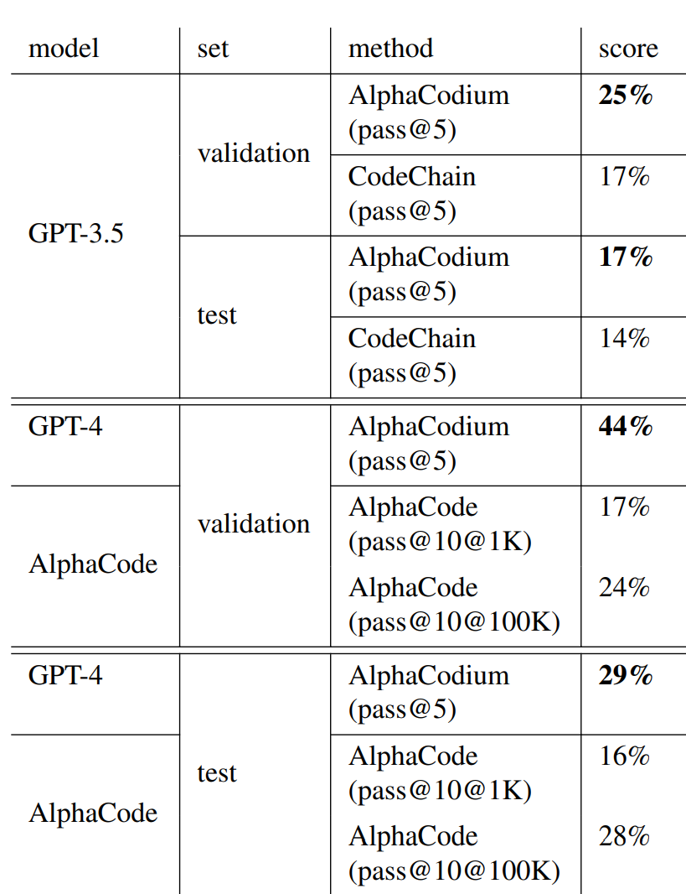

# Research Paper
---

## Table of Contents
---

- [x] Overview
- [x] Goal
- [x] Test Methodology
- [x] Results & Metrics

### Goal:
---
The study suggests a novel method for LLM code generation that we refer to as AlphaCodium. It is a multistage, test-based, code-oriented iterative flow that enhances LLM performance on code challenges.

### TEST METHODOLOGY:
---

The authors used a difficult code generation dataset called CodeContests, which contains competitive programming issues from websites like Codeforces, to test AlphaCodium. Results are regularly and noticeably improved by the suggested flow. Furthermore, it's important to note that code generation is a complex task in the field of artificial intelligence and machine learning. It involves creating a system that can automatically generate code based on a given input, often a natural language description or another piece of code. The fact that AlphaCodium was tested on competitive programming problems indicates that it might be quite advanced, as these problems often involve complex logic and require a deep understanding of programming.

### Result & Evaluation Metrics
---

According to the authors, The fact that AlphaCode employs a different generation methodology—fine-tuning a (unknown) model especially for code problems, generating a huge number of code solutions, clustering them, and submitting K solutions from the top clusters—must be considered when comparing AlphaCodium's work to that of AlphaCode. For example, pass@10@100K indicates that after 100K (!) solutions were created and clustered, 10 were ultimately selected and submitted. Using a refined model, AlphaCode applied a bruteforce-style strategy with a notably greater quantity of LLM calls. Yet, AlphaCodium's top outcomes are superior.

Table-1: Comparison of AlphaCodium flow results to direct prompt on various models.

Table-2: Comparison of AlphaCodium to other works
from the literature.

### References
---

Ridnik, Tal, et al. “Code Generation with Alphacodium: From Prompt Engineering to Flow Engineering.” arXiv.Org, 16 Jan. 2024, arxiv.org/abs/2401.08500. Accessed 23 Feb. 2024. ( https://arxiv.org/abs/2401.08500)
Chen, Mark, et al. “Evaluating Large Language Models Trained on Code.” arXiv.Org, 14 July 2021, arxiv.org/abs/2107.03374. Accessed 23 Feb. 2024.  (https://arxiv.org/abs/2107.03374)
Le, Hung, et al. “CodeChain: Towards Modular Code Generation through Chain of Self-Revisions with Representative Sub-Modules.” arXiv.Org, 28 Nov. 2023, arxiv.org/abs/2310.08992. Accessed 23 Feb. 2024. ( https://arxiv.org/abs/2310.08992)